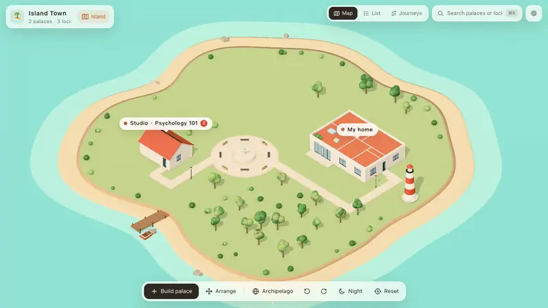
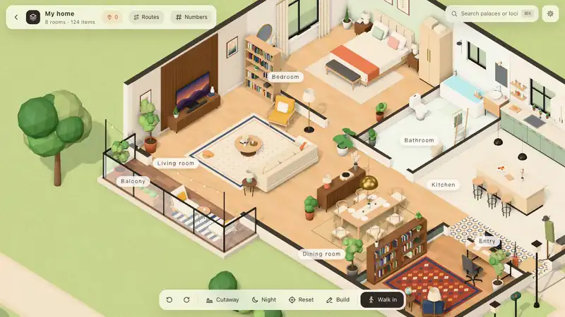
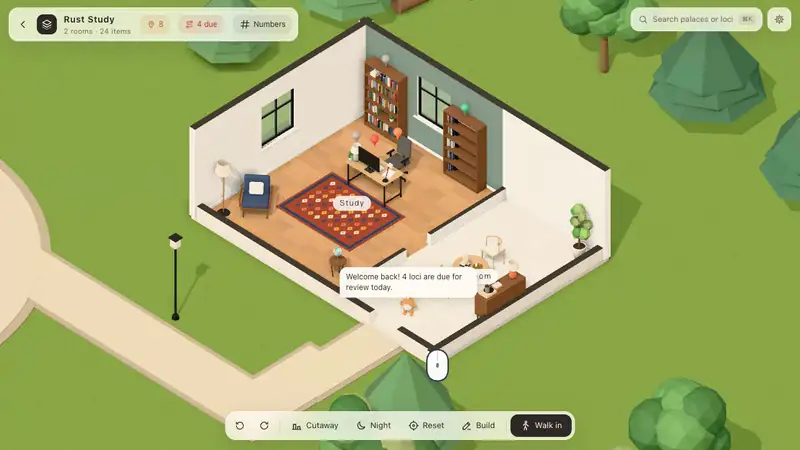
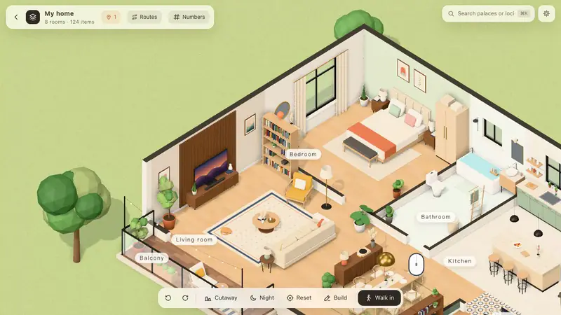
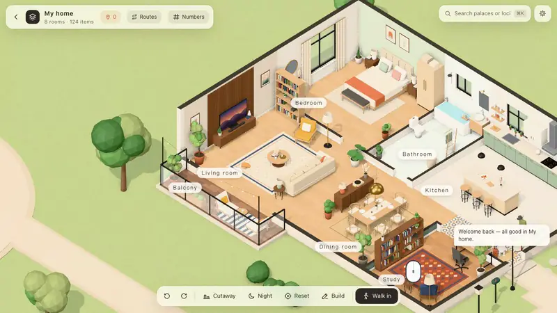
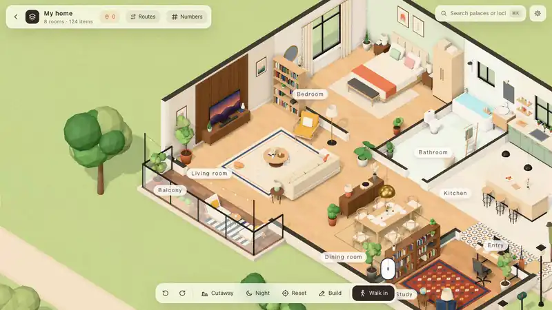
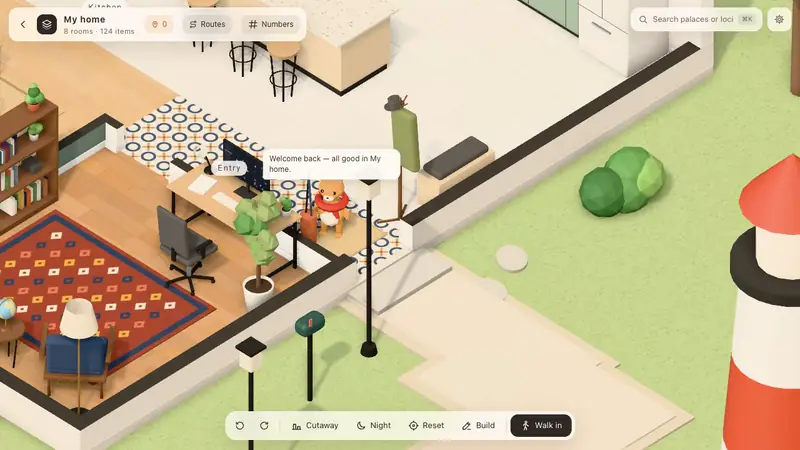
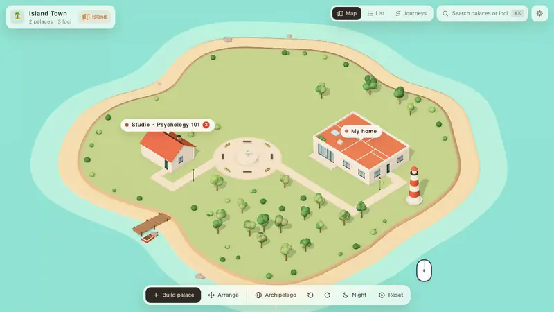

# KMind Palace

**English** | [简体中文](README.zh-CN.md)

> Put your notes into walk-in 3D houses and remember them with the method of loci. A plugin for SiYuan and Obsidian.



The memory palace (method of loci) is the technique memory champions use: place what you want to remember in a familiar room, then walk through it in your mind to recall it. KMind Palace brings this into your note app — your notes sit on the furniture of little 3D houses, you recall them by walking a route stop by stop, and your self-ratings feed spaced repetition.

The interface is available in **English** and **Simplified Chinese** and follows your app's language.

## See it in action

| | |
| :-: | :-: |
|  |  |
| **Bind notes to furniture.** Click any piece of furniture — or a single book on a shelf — and bind a note to it. It becomes a *locus*. | **Recall along a route.** Fly from stop to stop, think first, reveal, rate 1–4. Ratings drive spaced repetition. |
|  |  |
| **AI mnemonic stories.** Generate a vivid scene that ties the note to the spot, plus an illustration (any OpenAI-compatible API). | **Walk in.** Double-click the floor and walk through your palace in first person. |
|  |  |
| **Build your own.** Add furniture from a catalog, move and rotate it, edit rooms, walls, doors and windows. | **Your pet.** A little animal lives in your palace, greets you, reminds you what's due and leads the way during recall. Dress it up. |



**A whole world.** All your palaces live on islands: zoom out from the town to the archipelago, and further until it curls into a tiny planet.

## Features

- 🏝 **Your own world** — island town → archipelago → tiny planet; four scene themes (island, forest, snow peaks, sky islands).
- 📌 **Furniture as loci** — bind notes to furniture or to individual books; a bookshelf can mirror a whole notebook or folder.
- 🧭 **Routes & recall** — recall stop by stop with spaced repetition (SiYuan's built-in flashcards; built-in FSRS on Obsidian). Pins change color by memory strength; neglected furniture gathers cobwebs.
- 🏗 **Build mode** — furniture catalog, rooms, walls, doors & windows, photo-to-furniture recognition, shape kits, import your own 3D models (.glb), use your own photos.
- ✨ **AI memory aids** — mnemonic stories and illustrations; a person-action-object system for numbers.
- 🦉 **Your pet** — greets you, leads the way, five species and lots of accessories.
- 🔒 **Your data stays in your notes** — the plugin talks to no server.

## Install

- **SiYuan**: Bazaar → Plugins → search "KMind Palace" (思维宫殿).
- **Obsidian**: Settings → Community plugins → Browse → search "KMind Palace".
- **Manual**: download from [Releases](../../releases). SiYuan: unzip `package.zip` into `<workspace>/data/plugins/kmind-palace/`. Obsidian: put `main.js`, `manifest.json` and `styles.css` into `<vault>/.obsidian/plugins/kmind-palace/`.

User guides: [SiYuan](packages/siyuan-plugin/README.md) · [Obsidian](packages/obsidian-plugin/README.md) (Chinese)

## Build from source

Requires Node.js 22+ and pnpm.

```bash
pnpm install
pnpm dev:core                 # browser playground at http://127.0.0.1:5181 (?lang=en for English)
pnpm dev:siyuan               # watch-build the SiYuan plugin into packages/siyuan-plugin/dev
pnpm dev:obsidian             # watch-build the Obsidian plugin into packages/obsidian-plugin/dev
pnpm typecheck && pnpm test
scripts/release.sh            # build release assets into release/ (SiYuan package.zip + the three Obsidian files)
```

```
packages/
  core/             palace data format, three.js scene, UI and interaction (independent of any note app)
  protocol/         API types for the "visiting friends" feature
  siyuan-plugin/    SiYuan plugin
  obsidian-plugin/  Obsidian plugin
```

**Translations**: UI text goes through `t('中文原文')` with the English dictionary in `packages/core/src/i18n/en/`. `pnpm -C packages/core i18n` reports anything untranslated, and the test suite fails on it.

`core/src/social/` is the client for "visiting friends" (see each other's palaces). The server is not open source yet, and the feature is disabled in release builds; it only turns on when built with `KP_SERVER_URL`.

## Network use

- **AI features** (optional) send requests only to the OpenAI-compatible API you configure in the settings. Nothing is configured by default.
- The plugin connects to no other server and contains no telemetry or analytics. All palace data stays in your notes (SiYuan plugin storage / a folder inside your Obsidian vault).

## License

[Mozilla Public License 2.0](LICENSE): use, modify and distribute freely (including in commercial and closed-source products); if you distribute modified versions of files from this repository, publish those modifications.

The names "KMind Palace" / "思维宫殿" and the icon are not covered by the license. Please use a different name and icon if you publish a fork.
