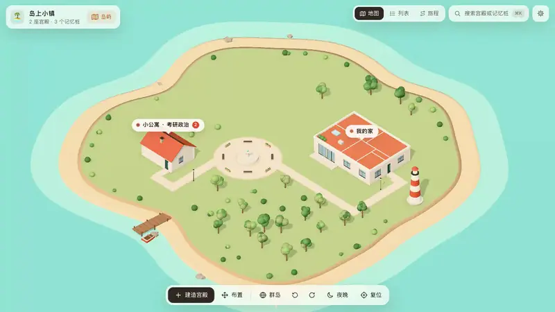
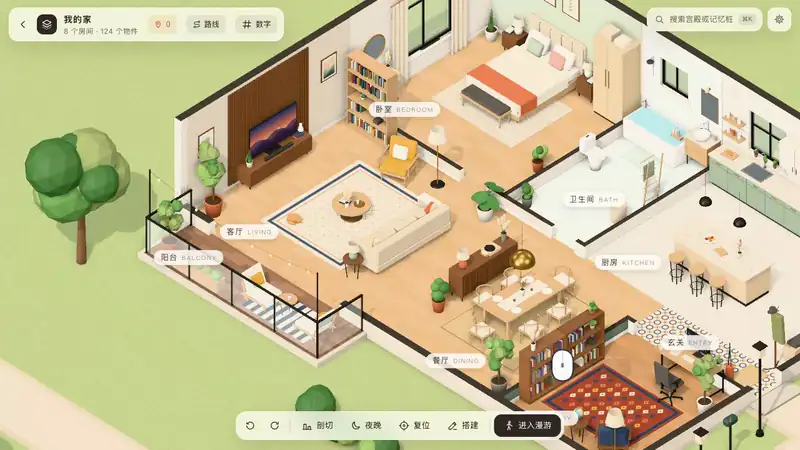
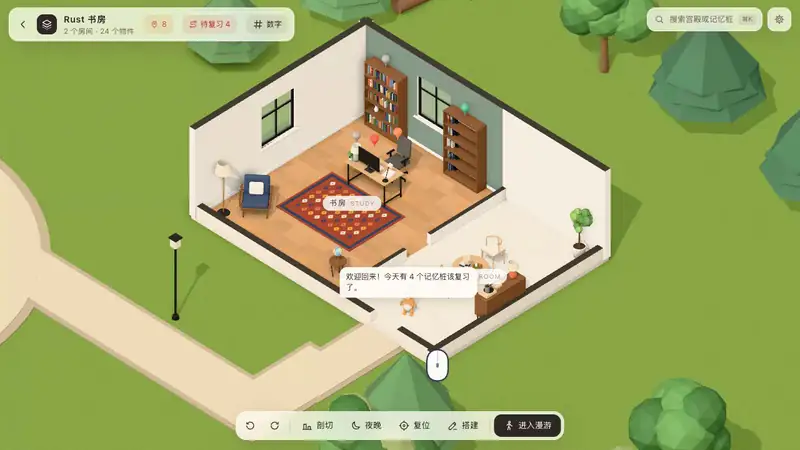
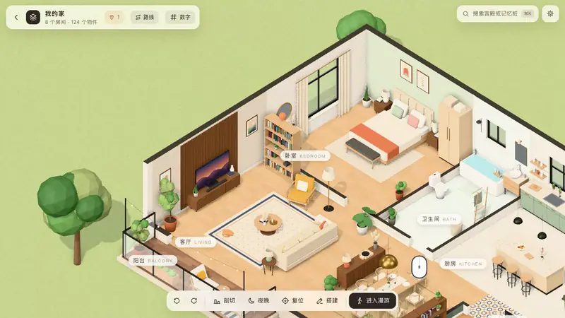
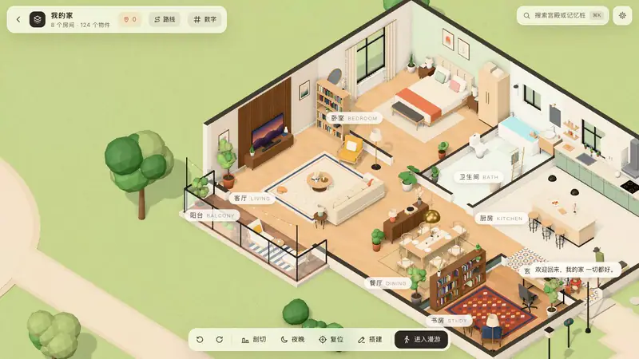
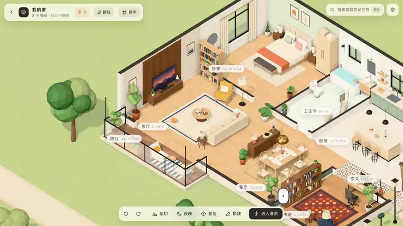
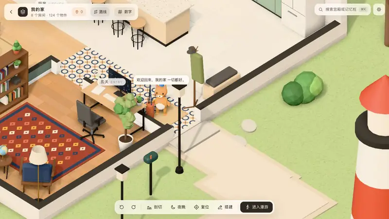
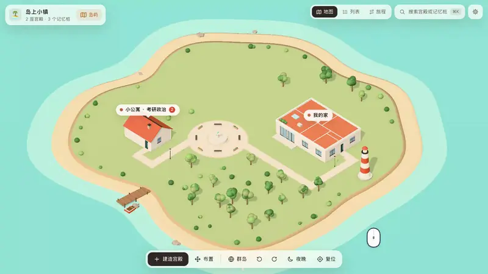

# 思维宫殿 KMind Palace

[English](README.md) | **简体中文**

> 把笔记放进一座座可以走进去的 3D 房子里，用「记忆宫殿法」记住知识。思源笔记、Obsidian 插件。



记忆宫殿（位置记忆法）是记忆比赛选手最常用的方法：把要记的东西放在熟悉的房间里，回想时在脑子里走一遍，一样样就想起来了。思维宫殿把这件事搬进笔记软件：笔记就摆在一座座小房子里的家具上，回忆时沿着路线一站站走，复习结果记进闪卡，按遗忘曲线安排下次复习。

界面支持**简体中文**和**英文**，跟随笔记软件的语言。

## 看看怎么用

| | |
| :-: | :-: |
|  |  |
| **家具就是记忆桩**：点一件家具（或书架上的一本书），绑定一条笔记。 | **沿路线回忆**：一站站飞过去，先想、再揭晓、四档自评，按遗忘曲线复习。 |
|  |  |
| **AI 帮你记**：一键编一个夸张好记的记忆故事，再配一张图（任意 OpenAI 兼容接口）。 | **走进去**：双击地板，以第一人称在宫殿里走动。 |
|  |  |
| **自己搭**：从目录添加家具，移动、旋转；改房间、墙和门窗。 | **小管家**：门口迎接你、提醒今天要复习几个、回忆时带路，还能换装。 |



**一个属于你的世界**：所有宫殿都在岛上，从小镇一直拉远到群岛，再卷成一颗小星球。

## 功能

- 🏝 **一个属于你的世界**：岛上小镇 → 群岛 → 小星球；海岛、森林、雪山、浮空岛四种场景。
- 📌 **家具就是记忆桩**：每件家具、书架上的每一本书都能绑定一条笔记；书架可以直接对应一个笔记本 / 文件夹。
- 🧭 **沿路线回忆**：先想、再揭晓、四档自评，按遗忘曲线复习（思源用自带闪卡，Obsidian 用插件内置的 FSRS）；图钉按记忆程度变色，久没复习的家具会结蛛网。
- 🏗 **自己搭**：摆家具、改房间和墙、开门窗；拍照识物、积木物件、导入 3D 模型、用自己的照片。
- ✨ **AI 帮你记**：记忆故事和配图（任意 OpenAI 兼容接口，思源也可以用内置 AI）；数字记忆（人物-动作-物件编码）。
- 🦉 **小管家**：五种动物，随意换装，陪你复习。
- 🔒 **数据都在你自己的笔记库里**：插件不连任何服务器。

## 安装

- **思源笔记**：集市 → 插件 → 搜索「思维宫殿」。
- **Obsidian**：设置 → 第三方插件 → 浏览 → 搜索「KMind Palace」。
- **手动安装**：在 [Releases](../../releases) 下载。思源用 `package.zip`，解压到 `<工作空间>/data/plugins/kmind-palace/`；Obsidian 用 `main.js`、`manifest.json`、`styles.css`，放到 `<库>/.obsidian/plugins/kmind-palace/`。

使用说明：[思源版](packages/siyuan-plugin/README.zh-CN.md)（完整手册）· [Obsidian 版](packages/obsidian-plugin/README.md)

## 从源码构建

需要 Node.js 22+ 和 pnpm。

```bash
pnpm install
pnpm dev:core                 # 浏览器里的 playground：http://127.0.0.1:5181（?lang=en 看英文界面）
pnpm dev:siyuan               # 监听构建思源插件到 packages/siyuan-plugin/dev
pnpm dev:obsidian             # 监听构建 Obsidian 插件到 packages/obsidian-plugin/dev
pnpm typecheck && pnpm test
scripts/release.sh            # 打包发布附件到 release/（思源 package.zip + Obsidian 三个文件）
```

```
packages/
  core/             宫殿的数据格式、three.js 场景、界面与交互（不依赖任何笔记软件）
  protocol/         串门功能的接口类型
  siyuan-plugin/    思源插件
  obsidian-plugin/  Obsidian 插件
```

**多语言**：界面文字写成 `t('中文原文')`，英文字典在 `packages/core/src/i18n/en/`；`pnpm -C packages/core i18n` 列出还没翻译的地方，测试也会拦住漏翻。

`core/src/social/` 是「串门」（好友互相参观宫殿）的客户端，服务端暂未开源；发布版里这个功能是关闭的，构建时设置了 `KP_SERVER_URL` 才会打开。

## 许可证

代码以 [Mozilla Public License 2.0](LICENSE) 开源：可以自由使用、修改、分发（包括商用和闭源产品）；修改了本仓库的源文件并分发时，需要公开这些文件的修改。

「思维宫殿」「KMind Palace」名称和图标不在许可范围内。fork 后发布到插件市场或应用商店时，请换一个名字和图标，避免和本项目混淆。
