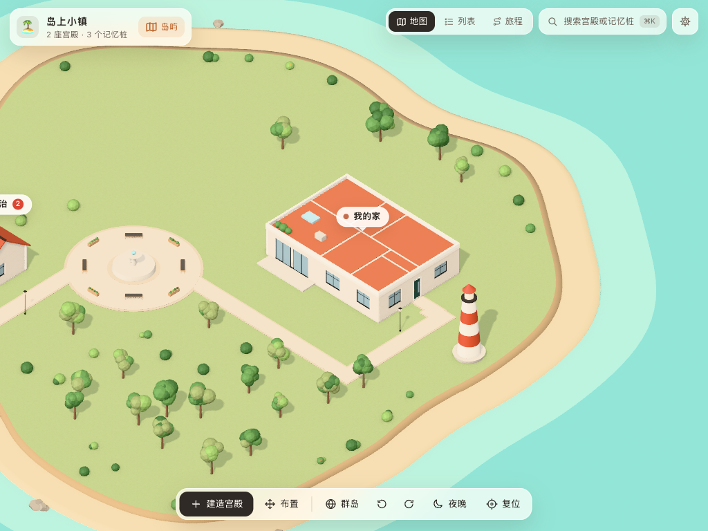

# 思维宫殿 KMind Palace · Obsidian

> 把笔记放进一座座可以走进去的 3D 房子里，用「记忆宫殿法」记住知识。


在 Obsidian 里搭建 3D 记忆宫殿：家具、书架上的每一本书都可以绑定一篇笔记、一个标题或一个段落；沿路线回忆，按遗忘曲线复习；宫殿里住着一只陪你复习的小管家。功能和思源版相同（小镇 / 群岛 / 小星球、搭建、记忆路线、回忆、旅程、数字记忆、记忆故事、拍照识物、小管家……），完整说明见思源版的 README，下面只说 Obsidian 版不一样的地方。



## 三分钟上手

1. 左侧功能区的宫殿图标（或命令面板「打开思维宫殿」），第一次打开会有几页引导。
2. 双击「我的家」走进去，**点一件家具** →「绑定笔记块」→ 选一篇笔记（或其中的标题、段落）。
3. 标题栏「路线」→「开始回忆」：先想，按 `空格` 揭晓，`1`–`4` 自评。

右上角 ⚙ 是设置：画质（卡顿时调低）、小管家、再看一遍引导。宫殿里点一下小管家可以给它换装。

## 打开

左侧功能区的宫殿图标，或命令面板「打开思维宫殿」。宫殿是一个页签，重启后回到上次所在的宫殿。

## 绑定笔记

- 「绑定笔记块」先选一篇笔记，再选「整篇 / 某个标题 / 某一段」。
- 选一段时，插件会在那一段末尾加上块 id（`^kp-xxxxxx`，和 Obsidian 的「复制块链接」一样），宫殿里记下的是 `笔记路径#^kp-xxxxxx`。
- 标题按标题文字记（`笔记路径#标题`）；改了标题文字，记忆桩会提示「已不存在」，重新绑定即可。
- **改名、移动笔记或文件夹**时，宫殿里的绑定、书架书目、闪卡排期会自动跟着改。
- 悬停在记忆桩上弹出 Obsidian 的页面预览；点击在新页签打开，按住 `Alt` 在右侧分屏打开。

## 书架 = 文件夹

搭建模式里选中书架 →「书目 → 摆上笔记本…」，选一个文件夹：里面的笔记按名称排成一本本书，书脊上写着标题。

## 闪卡

Obsidian 没有自带闪卡，回忆时的自评由插件自己排期（FSRS-5，目标记忆率 90%），记在数据文件夹的 `review.json` 里，随库同步。

## 数据

全部存在库里的一个文件夹（默认 `KMind Palace`，插件设置里可以改），随库一起同步（Obsidian 同步、iCloud、git 都行）：

- `palaces/<id>.json` 每座宫殿一个文件；`world.json` 岛和宫殿的摆放、旅程、数字编码表、小管家；`index.json` 宫殿列表；
- `backups/` 数据格式升级前的原样备份；
- `review.json` 闪卡排期；
- `media/` 照片、配图、导入的 3D 模型（文件名是内容哈希）。

别的设备同步过来改动了这些文件时，打开着的宫殿会自动刷新。写回笔记的配图会复制成库里的附件（`kmind-palace-<哈希>.webp`，位置按 Obsidian 的附件设置）。

## 大模型

插件设置里填 OpenAI 兼容接口（OpenAI、DeepSeek、通义千问、本地 Ollama……）。请求走 Obsidian 的 `requestUrl`，没有跨域问题，手机上也能用。API Key 只存在插件自己的设置（`.obsidian/plugins/kmind-palace/data.json`）里，不会写进宫殿数据。

## Network use

- **AI features** (optional) send requests only to the OpenAI-compatible API you configure in the settings. Nothing is configured by default.
- The plugin connects to no other server and contains no telemetry or analytics. All palace data lives in a folder inside your vault.

## 开发

```bash
pnpm --filter kmind-palace-obsidian dev          # 监听构建到 dev/
pnpm --filter kmind-palace-obsidian run link <库路径>  # 软链接到 <库>/.obsidian/plugins/kmind-palace
pnpm --filter kmind-palace-obsidian build        # 发布构建到 dist/
pnpm --filter kmind-palace-obsidian test         # Markdown 处理的单元测试
```

本机调试时可以起一个和日常使用完全隔离的 Obsidian 实例（独立的用户目录，不动本机的库列表和设置）：

```bash
/Applications/Obsidian.app/Contents/MacOS/Obsidian --user-data-dir=<临时目录> --remote-debugging-port=9333
```

在 `<临时目录>/obsidian.json` 里写好测试库的路径（`{"vaults":{"<任意 id>":{"path":"<库路径>","ts":0,"open":true}}}`），再用 Chrome 开发者协议连 9333 端口驱动页面。
