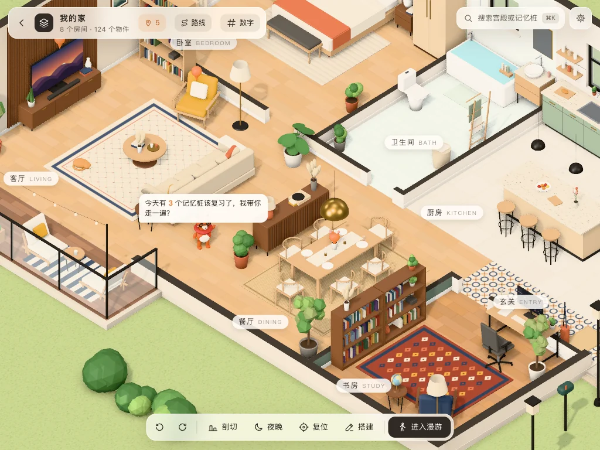

# 思维宫殿 KMind Palace

> 把笔记放进一座座可以走进去的 3D 房子里，用「记忆宫殿法」记住知识。

记忆宫殿（位置记忆法）是记忆比赛选手最常用的方法：把要记的东西放在熟悉的房间里，回想时在脑子里走一遍，一样样就想起来了。思维宫殿把这件事搬进思源：你的笔记就摆在一座座小房子里的家具上，回忆时沿着路线一站站走，复习结果直接记进思源闪卡。

界面支持简体中文和英文，跟随思源的语言设置。

| 把笔记绑到家具上 | 沿路线回忆 | AI 记忆故事 |
| :-: | :-: | :-: |
|  |  |  |

更多演示见 [GitHub](https://github.com/suka233/kmind-palace/blob/main/README.zh-CN.md)。

## 亮点

- 🏝 **一个属于你的世界**：岛上小镇 → 群岛 → 小星球，所有宫殿都在里面；海岛、森林、雪山、浮空岛四种场景。
- 📌 **家具就是记忆桩**：每件家具、书架上的每一本书都能绑定一个笔记块；书架还能直接对应一个笔记本。
- 🧭 **沿路线回忆**：先想、再揭晓、四档自评，结果记进思源闪卡，按遗忘曲线安排复习；图钉按记忆程度变色，久没复习的家具会结蛛网。
- ✨ **AI 帮你记**：一键生成夸张好记的「记忆故事」和配图（思源内置 AI 或任意 OpenAI 兼容接口）；拍照识物把真实的家具搬进宫殿；数字记忆（人物-动作-物件编码）。
- 🦉 **小管家**：宫殿里住着一只小动物，门口迎接你、提醒今天要复习几个、回忆时一站站带路；五种动物、随意换颜色和配饰。
- 🔒 **数据都在你自己的思源里**：宫殿随思源同步，插件不连任何服务器；只有你自己配置了大模型接口时，AI 功能才会请求那个接口。

## 三分钟上手

1. 点顶栏的宫殿图标（或 `⌥⇧M`）打开「思维宫殿」页签；第一次打开会有几页引导。
2. 双击小镇上的「我的家」走进去，**点一件家具** →「绑定笔记块」→ 搜一个块。
3. 多绑几件之后，点标题栏的「路线」→「开始回忆」：镜头一站站飞过去，先自己想，按 `空格` 揭晓，再按 `1`–`4` 自评。

右上角 ⚙ 是设置：画质（卡顿时调低）、小管家、再看一遍引导。宫殿里**点一下小管家**可以给它换装。

## 使用手册

- 点击顶栏的宫殿图标（或 `⌥⇧M`）打开「思维宫殿」页签，先来到**岛上小镇**：你所有的宫殿都在这座岛上。

### 岛上小镇

- **看**：鼠标悬停在一座宫殿上，屋顶会掀开，露出里面的房间和家具；单击查看卡片（记忆桩、主题色、屋顶），**双击进入**。
- **进出**：进入时镜头飞进去、墙体剖开；宫殿里点左上角的 `←`（或在没有选中物件时按 `Esc`）回到小镇。
- **建造宫殿**：底部「建造宫殿」→ 起名、选模板（小屋 / 两居室 / 长廊 / 我的家）→ 在岛上点击空地放下，道路会自动从门口接到广场。
- **布置**：「布置」（或 `B`）后拖动宫殿换位置（1 m 网格），`R` 旋转 90°，`⌘Z` 撤销；离其他宫殿或广场太近时会变红，放不下。
- **小岛会跟着长大**：宫殿越多、摆得越开，岛就越大；道路、树木、路灯、灯塔、码头会自动重新安排。
- **屋顶**：默认按占地自动选择（小而方正 → 坡顶，大或不规则 → 平顶），颜色取宫殿主题色；卡片里可以改。
- **列表**：右上角「列表」按更新时间列出所有宫殿；`⌘K` / `Ctrl+K` 搜索宫殿或记忆桩，回车直接飞过去（在宫殿里也能用）。
- **旅程（跨宫殿路线）**：右上角「旅程」把几座宫殿里的路线按顺序串起来（一门课分在几座宫殿里时很有用）。面板打开时名牌上标出每座宫殿是第几段。「开始回忆」后一座宫殿走完，会提示下一座、淡出淡入接着走，最后一起结算；也可以在宫殿的路线面板里把当前路线「加入旅程」。
- 名牌远看只显示名字，拉近或悬停时显示记忆桩数量。

### 群岛

- **拉远就是群岛**：滚轮一直缩小（或点底部「群岛」），会看到所有的岛；岛上显示名牌（岛名、宫殿数、记忆桩数）。单击岛看设置，双击飞过去。
- **场景主题**：每座岛可以是 🏝 海岛（沙滩、灯塔、码头）、🌲 森林（古树广场、瞭望塔、林间池塘）、🏔 雪山（雪山、冰屋、浮冰，屋顶积雪）、☁️ 浮空岛（悬在海面上方，瀑布、风车、热气球）。岛屿卡片里随时可以换场景，宫殿不受影响。
- **开辟新岛**：群岛视角下「开辟新岛」→ 起名、选场景，新岛会出现在群岛旁边，镜头自动飞过去。
- **布置岛屿**：群岛视角下「布置岛屿」拖动整座岛；岛和岛之间会留出海面，岛长大挤到邻岛时会自动推开。
- **搬家**：宫殿卡片里「搬到」选另一座岛，宫殿会在那座岛上自动找空地。
- 宫殿列表按岛分组；`⌘K` 也能搜岛名。
- **航线**：相邻的岛之间有白色虚线航线和小帆船，自动按距离连接。

### 小星球

- 群岛视角下继续拉远（或点底部「星球」），整个世界会慢慢卷成一颗悬在星空里的小星球，带一圈大气光晕，浮空岛飘在星球上方。
- **转动星球**：拖动就能转，松手后会带一点惯性；右键拖动绕着看。
- 星球上的岛名牌跟着球面走，转到背面的会自动藏起来；双击一座岛，镜头飞下去，星球慢慢展开回平面。
- 在星球上用 `⌘K` 跳到某个记忆桩，会先展开、飞到那座岛，再进宫殿。

### 宫殿里
- **俯视**：左键拖动平移，右键拖动旋转，滚轮缩放；`Q` / `E` 旋转 90°，`W` 切换墙体，`N` 切换日夜。
- **绑定**：点选物件 →「绑定笔记块」→ 搜索文档 / 块（也可以粘贴块引用、块链接或块 ID）。
- **书架上的每一本书都能单独绑定**：直接点书（悬停时书会高亮），卡片上会显示「第 2 层 · 第 5 本」；绑定过的书会往外抽出一截、插上橙色书签。卡片里「选中整个书架」回到整件物件，整件的卡片会列出它上面已绑定的书。书架改窄放不下的书会标成「已不在」，绑定保留，调回尺寸即可恢复。
- **回想**：鼠标悬停在已绑定的物件上会弹出笔记预览；点击卡片或双击物件打开笔记，按住 `Alt` 在右侧分屏打开。
- **漫游**：「进入漫游」或双击地面，`WASD` 移动，拖动转视角，准星对准物件时按 `F` 打开绑定的笔记。
- **书架 = 笔记本**：在搭建模式里选中书架，卡片上「书目 → 摆上笔记本…」，选一个笔记本（摆它的顶层文档）或一篇文档（摆它的子文档）。每本书就是一篇文档，书脊上写着标题，顺序和文档树一致；新建、删除、改名、移动文档时书架自动更新。点一本书可以直接打开；「设为记忆桩」后它会出现在路线和回忆里。放不下的书会在卡片上提示，加宽书架或加层即可。
- **摆件**：茶几上的书和杯子、餐桌上的花瓶和餐具、书桌上的绿植……都是可以单独挪动、删除、绑定的小物件；目录里新增「摆件」分类（一摞书、相框、花瓶、杯子、托盘、烛台、餐具、果盘）。
- **拍照识物**：搭建模式 →「添加物件」→「📷 拍照识物」，拍一张家具或物品的照片，模型会从目录里挑最接近的类型、按照片调尺寸和颜色；目录里没有的东西用「积木」拼出来。需要能看图的模型（插件设置 →「识图模型」）。
- **积木**：用长方体、圆柱、球、车削轮廓等基础形体拼出的物件（目录「积木」里有落地钟、鱼缸两个示例）；在卡片上「编辑 JSON」可以手改，带 `slot` 和 `name` 的部件（表盘、钟摆、小丑鱼…）可以单独绑定记忆桩。
- **导入 3D 模型**：「添加物件」→「导入 .glb」，模型按高度缩放、落地居中，可以在卡片上调高度。文件存在插件存储里，随思源同步（30 MB 以内）。
- **颜色**：沙发、椅子、桌面、柜体等的材质下拉里有「自定义颜色…」，可以挑任意颜色。
- **用自己的照片**：选中装饰画、相框、海报、地毯或电视柜，在卡片上「照片 → 选照片…」，照片会压缩后保存；画框、海报按照片比例调高度，地毯按比例调宽度，电视上的照片会像屏幕一样发光。
- **书架平面图**：选中书架（或书架上的一本书），卡片上「📚 书架平面图」打开书架的正视图：点一本书可以单独换颜色、向左 / 向右靠、抽出一点、空出这一格，也能直接绑定 / 解绑——一整架书批量绑定比在三维里一本本点方便。笔记本书架上的调整按文档记，文档顺序变了也跟着走。
- **数字记忆**：标题栏的「#」。把一长串数字（圆周率、电话、年份……）粘贴进去，选「人物-动作-物件 · 6 位一桩」或「两位一图」，数字会沿着宫殿里的家具（或某条路线）一桩桩摆好，场景里标出每桩的数字，卡片上显示这一桩的画面。「编码表」里是 00–99 的编码：默认带一套常见的物件编码，可以填上自己的人物和动作（也能整段粘贴导入），填了之后 6 位数就组成「人物 动作 物件」的一个画面。「开始回忆」后逐桩输入数字核对，错的位会标红，最后可以「再练错的」。
- **记忆故事**：选中一个已绑定的记忆桩，卡片下方可以写一个「记忆故事」——把笔记内容想象成发生在这个位置上的夸张小场景。可以自己写，也可以点「✨ AI 编一个」让大模型编（会参考笔记正文和路线上的前后两站）；配置了生图后还能「🎨 配图」。「写回笔记」会在绑定的块下面插一段引述（带配图），再写一次时更新同一块。回忆时揭晓答案会同时显示故事和配图；揭晓前可以先「看图提示」。
- **大模型设置**（插件设置）：默认用思源内置 AI（设置 → AI 里配好的模型）；也可以填自己的 OpenAI 兼容接口（DeepSeek、通义、Kimi、本地 Ollama 等）和生图接口。请求经思源内核转发，没有跨域问题，手机上也能用；本机 / 内网地址由页面直接请求。API Key 只存在插件自己的配置文件 `ai.json` 里，不会写进宫殿数据，也不会随宫殿导出。
- **记忆路线**：点标题栏的「路线」。没建过路线时，默认路线从正门出发、按位置串起全部记忆桩；也可以新建路线，打开「在场景里点选」后按顺序点击记忆桩，用 ↑ ↓ 调整顺序。打开面板时地上会画出路线（沿着能走的路绕开墙和家具），每站一个编号。
- **回忆**：在路线面板点「开始回忆」（或「只练需要练的」跳过记得牢的），镜头沿路线一站站飞过去，只显示位置——先在心里说出这里放的是什么，再按 `空格` 揭晓笔记内容，然后自评 `1` 忘了 · `2` 困难 · `3` 记得 · `4` 简单。`←` `→` 前后切换，`Esc` 结束。走完一遍可以「再练一遍没记住的」。
- **和思源闪卡互通**：回忆时的自评直接记到思源的内置卡包（还不是闪卡的块会自动加入），和在「闪卡」里复习的是同一张卡。图钉和书签按记忆程度变色：橙色 还没复习过 · 琥珀 学习中 · 绿色 记得牢 · 红色 该复习了 · 灰色 很久没复习（物件上还会结蛛网）。小镇名牌上的红点是待复习数，宫殿卡片上可以直接「进去回忆」。
- **搭建**：点「搭建」（或按 `B`）进入编辑模式：
  - 拖动物件移动（小物件可以叠放到桌面、柜面上，放上去之后会随家具一起移动、复制、删除；装饰画、镜子、吊柜等挂墙物件会吸附墙面，可以拖到另一面墙）；
  - 拖动脚下的橙色圆点旋转，`R` 旋转 90°，`[` `]` 微调 15°，方向键微移 5 cm（`Shift` 50 cm）；
  - 默认按 5 cm 网格 / 15° 吸附，按住 `Alt` 临时关闭；
  - 「添加物件」打开目录（带缩略图），单击放置，按住 `Shift` 连续放置；
  - 卡片里可以改名、复制（`⌘D`）、删除（`Delete`），调整尺寸、颜色、花纹等参数；
  - `⌘Z` / `Ctrl+Z` 撤销，`⇧⌘Z` / `Ctrl+Y` 重做。改动会自动保存。
- **房间**（搭建 → 房间）：单击地面选中房间；拖动橙色把手调整大小（边上的墙、相邻房间一起移动）；拖动房间内部移动名称标签；「新建房间」在地面上拖出矩形，可自动砌墙；面板里改名称、地面材质、室内 / 室外。
- **墙体**（搭建 → 墙体）：单击墙体选中（选中的墙会完整显示）；拖动平移，相连的墙自动伸缩；拖动两端圆点改变长度；「画墙」单击起点和终点连续画墙，会吸附已有的墙；面板里改厚度、给这一面墙刷颜色或贴瓷砖，在点击的位置开门、窗、推拉门。
- **门窗**：单击选中后沿墙拖动；面板里改类型、宽高、窗台高度、开门方向、窗帘。
- 外墙会自动识别（决定俯视时哪些墙保持全高），地基会随房子自动扩大。

## 数据

数据保存在 `data/storage/petal/kmind-palace/`，随思源同步：

- `palaces/<id>.json` 每座宫殿一个文件；
- `world.json` 记录有哪些岛（名字、场景、位置）、宫殿在岛上的位置、朝向和屋顶，以及旅程、数字编码表和小管家；丢失时会按宫殿列表自动重新摆放，宫殿内容不受影响；
- `index.json` 宫殿列表；
- `backups/<id>.v<n>.json` 数据格式升级前的原样备份（旧版宫殿第一次被新版插件读取时生成，已有就不覆盖）；
- `ai.json` 大模型设置（含 API Key）；
- `media/` 自己的照片、记忆故事的配图（压缩后的 webp）、导入的 3D 模型（glb），文件名是内容哈希（同一张照片只存一份）。不放进思源的 assets：「清理未引用资源」只看笔记里的引用，会把它们当成未引用删掉。

数据格式带版本号（version）和最低可读版本（compat）：新版插件会自动升级旧数据；只新增了可选字段的新版数据，旧一些的插件也能打开；真正不兼容时会提示升级插件，那座宫殿保持原样、不会被改写。多台设备同步时请都升级到新版。

## 常见问题

- **卡顿 / 发热**：右上角 ⚙ → 画质选「中」或「低」。「自动」会按设备挑选，持续卡顿时会自动降一档。
- **手机上能用吗**：能。单指拖动平移、双指缩放旋转，漫游模式左下角有摇杆。
- **我的笔记会被上传吗**：不会。插件不连任何服务器；只有配置了大模型时，生成记忆故事 / 配图 / 拍照识物才会把相关内容发给你配置的接口。
- **多台设备**：宫殿数据随思源同步。
- **小管家不见了**：⚙ →「叫它回来」。
